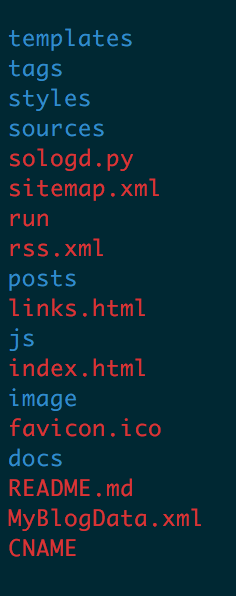

## 引子
1. BAE的域名要备案了，所以我的原来的博客 [http://codecos.com](javascript:void(0))，无法使用了。  
找了一下国内的其它的免费的空间或引擎都是需要域名备案的。

2. 之前就知道github是可以创建个人网站，还可以绑定一个域名，这货可是国外的，就不需要域名备案。
github pages使用的是Jekyll引擎，如果你以一定的结构存放markdown文档的话，是可以自动生成html的，我这里没有去用这个，
学习一个东西好像没什么必要，你可以参考[这篇文章](http://www.ruanyifeng.com/blog/2012/08/blogging_with_jekyll.html)。

3. 我使用python开发的，网站根据一定的结构组织，使用mako模板引擎，markdown文档放在一个指定的目录，然后执行以下python脚本就可以解析markdown文档并使用模板生成整个网站的内容了。

4. 对比我之前的网站，这个网站是全静态化的，速度上会有优势，而且文章和tag的URL更加的友好，总之我比较满意。
网站地址：[http://daimin.github.io](http://daimin.github.io)，就是这篇文章所在。

## 使用
  
  

  * **templates** 是模板，可以修改页面
  * **tags** 是程序自动生成的标签
  * **styles** css文件所在目录
  * **sources** 我们书写的markdown文件
  * **sologd.py** 处理脚本，通过执行`python sologd.py`生成博客html
  * **sitemap.xml** 自动生成的网站地图
  * **rss.xml** 自动生成的rss文件
  * **posts** 生成的博客文章html文件
  * **links.html** 生成的外链页面
  * **js** js文件所在目录
  * **index.html** 首页
  * **image** 图片目录
  * **CNAME** github配置CNAME 域名文件
  * **run** `./run` 执行脚本，并提交到github的快捷命令脚本(Linux/OSX)

##感谢
* 感谢python
* 感谢老婆
* 以上

